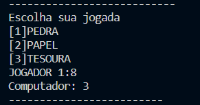
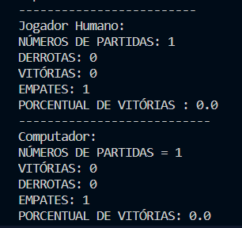

# 🎮 Jokepo - Rock-Paper-Scissors Game Simulator

A simple yet interactive implementation of the classic rock-paper-scissors game with three gameplay modes.

## 📋 Table of Contents
- [🚀 Features](#-features)
- [🎲 Game Modes](#-game-modes)
- [⚙️ Installation](#-installation)
- [🕹️ How to Play](#-how-to-play)
  - [🚀 Starting the Game](#-starting-the-game)
  - [🎮 Selecting the Game Mode](#-selecting-the-game-mode)
  - [✋ Making Your Move](#-making-your-move)
  - [🏆 Viewing the Results](#-viewing-the-results)
- [💻 Technologies](#-technologies)
- [🤝 Contributing](#-contributing)
- [📜 License](#-license)

## 🚀 Features
- 3 different gameplay modes
- Interactive score tracking
- Computer AI opponent
- Simple terminal-based interface

## 🎲 Game Modes

### Human vs. Human 🤼
- Two players take turns making choices
- Perfect for local multiplayer

### Human vs. Computer 🤖
- Play against computer logic
- Computer choices are randomized

### Computer vs. Computer 🤖🤖
- Watch AI battle it out
- Fully automated gameplay

## ⚙️ Installation
1. Clone the repository:
```bash
git clone https://github.com/MicaelFone/Frontend--questionario.git
```

## 🕹️ How to Play

### 🚀 Starting the Game
To start the game, run the following command in the terminal:
```bash
python jokepo.py  # Or use the appropriate command for your implementation
```

### 🎮 Selecting the Game Mode
When you start, you will see the game mode selection screen:

</img>

### ✋ Making Your Move
If playing against another player or the computer, choose your move:



### 🏆 Viewing the Results
After all rounds, check the final scoreboard:



## 💻 Technologies
- Python (or appropriate language)
- Simple terminal interface
- Randomization algorithms

## 🤝 Contributing
Contributions are welcome! Please follow these steps:
1. Fork the project
2. Create your feature branch:
   ```bash
   git checkout -b feature/AmazingFeature
   ```
3. Commit your changes:
   ```bash
   git commit -m 'Add some AmazingFeature'
   ```
4. Push to the branch:
   ```bash
   git push origin feature/AmazingFeature
   ```
5. Open a Pull Request

## 📜 License
This project is licensed under the MIT License.
