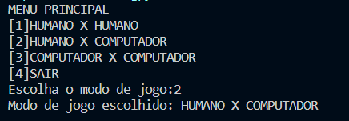

# 🎮 Jokepo - Rock-Paper-Scissors Game Simulator

A simple yet interactive implementation of the classic rock-paper-scissors game with three gameplay modes.

## 📋 Table of Contents
- [Features](#-features)
- [Game Modes](#-game-modes)
- [Installation](#-installation)
- [Usage](#-usage)
- [Technologies](#-technologies)
- [Contributing](#-contributing)
- [License](#-license)

## 🚀 Features
- 3 different gameplay modes
- Interactive score tracking
- Computer AI opponent
- Simple terminal-based interface

## 🎲 Game Modes

### Human vs. Human 🤼
- Two players take turns making choices
- Perfect for local multiplayer

### Human vs. Computer 🤖
- Play against computer logic
- Computer choices are randomized

### Computer vs. Computer 🤖🤖
- Watch AI battle it out
- Fully automated gameplay

## ⚙️ Installation
1. Clone the repository:
```bash
git clone https://github.com/MIcaelFone/Frontend--questionario.git
```
## 🕹️ Usage
1. Start the game:
```bash
python jokepo.py  # or use the appropriate command for your implementation
```
2. Select game mode:
</img>
3.Make your move (if playing against human/computer):
 </img> 
4.View final results:
</img> 

